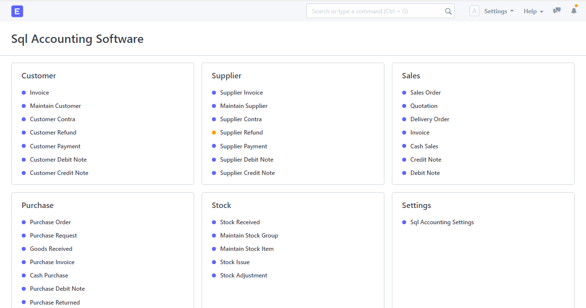
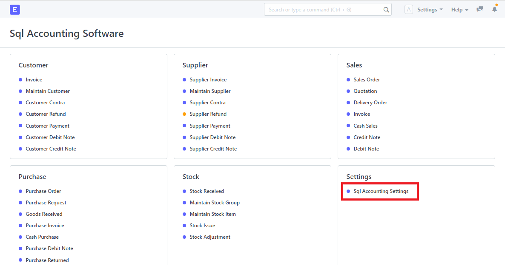
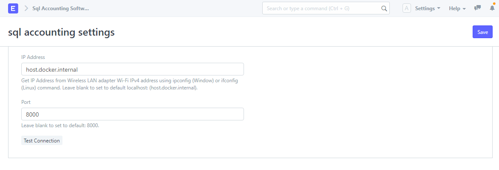

# ERPNext Sql Accounting Integration

## Sql Accounting Integration for ERPNext based on Frappe Framework
Sql Accounting ERPNext custom app is built based on [SQL Account](https://www.sql.com.my/accounting-software) software. It is built to integrate with ERPNext, act as a connector that allows bidirectional data transfer between Sql Accounting software and ERPNext. With Sql Accounting ERPNext custom app, only one copy of Sql Account software is required to install on the main computer, other computers in the same network can read or write data through ERPNext. More information can be found in the [Wiki section](https://wiki.sql.com.my/wiki/SQL_Accounting_Linking).

## Features
1. Customer, Supplier, Sales, Purchase and Stock categories with related doctypes for users to read or write records.
2. Automatic import data from SQL Account 
3. Automatic export data to SQL Account

## Installation

### Pre-requisites
1. [SQL Account](https://www.sql.com.my/download/demo/sqlacc-setup.exe)

- Setup guide: https://www.sql.com.my/download/demo/sqlacc-setup.exe

2. [Firebird](https://github.com/FirebirdSQL/firebird/releases/download/R3_0_4/Firebird-3.0.4.33054_0_x64.exe)

- Setup guide: https://wiki.sql.com.my/wiki/Firebird

3. SQL Account API

- Setup guide is available at: https://github.com/Nb-Richard/sql_account_api

4. Installed ERPNext which runs on localhost. 

- Installation guide refers to: https://github.com/msf4-0/IRPS-SQL_Accounting-Autocount-frepple

## Setup
By default, the IP address is set to docker localhost with port of `8000` (http://host.docker.internal:8000). If the app is not running on main computer which installs SQL Account software, users must configure the settings before using.

1. Go to SQL Accounting Settings.

2. Make change to IP address and port.

- If SQL Account software is installed on the same computer, the IP address can be set to default: `host.docker.internal`. Otherwise, run `ipconfig` on the main computer, the IP address is the `IPv4 Address` under `Wireless LAN adapter Wi-Fi` section.

- The default port number is 8000. However, users can change it by inserting a port number under port. 

3. Press `Test Connection` button to test if the connection is working. Remember to press `Save` to save changes.

4. Restart Docker image by running `docker-compose -p project1 restart` if any issue occurred. 

## Compatibility
SQL Account software only support Windows. However, ERPNext supports all major platforms (Windows, MacOS and Linux) which are compatible with Docker. 

## Important Note
SQL Accounting ERPNext custom app may not validate all data when being exported to SQL Account software. The user must have basic knowledge of SQL Account to avoid any error. 

## Author
1. [Richard](https://github.com/Nb-Richard)

## License
This software is licensed under the [GNU GPLv3 LICENSE](/LICENSE) © [Selangor Human Resource Development Centre](http://www.shrdc.org.my/). 2022.  All Rights Reserved.
